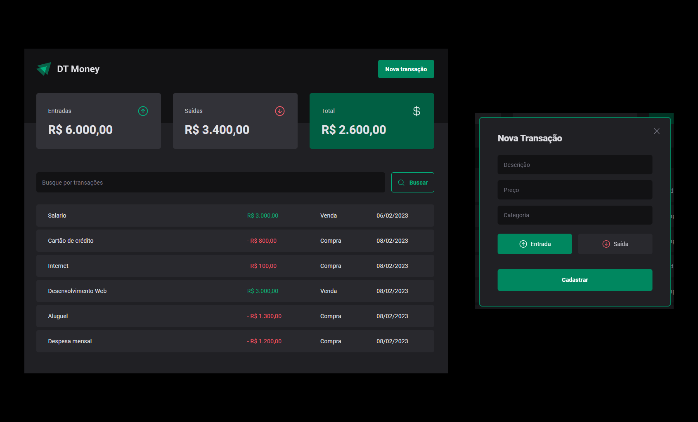

<div align="center">

</div>

<div align="center">
 <h2>Projeto criado no curso ReactJS pela  
 
 [Rocketseat](https://github.com/Rocketseat).
 
 </h2> 
  
</div>
<br><br>
<div align="center">

</div>

***<h1> Sobre o projeto </h1>***

[Acesse o Projeto](https://dt-money-six-sooty.vercel.app/)

<h3>
DT-Money foi criado para uso pessoal, para administrar suas finanças  pessoais.<br>
Você podera adicionar Entradas e Saídas e nomear do jeito que preferir.
<br><br>
</h3>

---

<h2> Instalação do projeto no seu computador e rodar aplicação </h2>

```
Requisitos -> Node

terminal:

# clone o repositório do github.
$ git clone https://github.com/allesoares95/dt-money

# acessar a pasta do projeto pelo terminal.
$ cd dt-money

# instalação das dependências.
$ npm i

# rodar banco de dados.
$ npm run dev:server

# rodar aplicação web.
$ npm run dev

# aplicação será aberta no http://localhost:5173
```
<br>

---

### Tecnologias utilizadas no projeto
<h3>

 ``` 
| React | TypeScript | Styled-components | Phosphor-react |
| Radix | JSON-Server | Hooks | Axios | ESLint | React - Tools |
| Memo - React |
 ```
</h3>

---

### CSS styled-components

```
npm i styled-components

npm i @types/styled-components -D`
```
---

## Phosphor-react

```
npm i phosphor-react
```

---
## Radix

  * Dialog

  ```
  npm install @radix-ui/react-dialog
  ```
    
    - Utilizando
    Dialog.Trigger
    Dialog.Portal
    Dialog.Overlay
    Dialog.Content
    Dialog.Title
    Dialog.Close

---

## Radio Group

```
npm install @radix-ui/react-radio.group
```

---

## JSON Server

```
npm i json-server
``` 

modificações de arquivo;

  [Visualização rocketseat](https://github.com/rocketseat-education/ignite-reactjs-03-dt-money/commit/d6085ce590508a543af916856c23d33e68019b9d)

  para rodar json 
  ```
  npx json-server server.json 
  ```

  para deixar atualizando json automatico utilizar -w no final 
  ```
  npx json-server server.json -w 
  ```

  adicionando delay nas requisições de 500ms
  ``` 
  npx json-server server.json -w -d 500
  ```

  pode alterar npm run pelo package.json
    adicionando um novo scripts 
   ```
  "dev:server": "json-server server.json -w -d 500" 
   ```

  rodar:
  ```
  npm run dev:server
  ```
---
## AXIOS

```
npm i axios
``` 

---

## ESLint 

instalando como dependência de desenvolvimento

```
npm i eslint -D
```

pacote da rocketseat ;

```
npm i @rocketseat/eslint-config -D
```

para testar e corrigir erros ;

```
npx eslint src --ext .ts,.tsx --fix
```

para deixar automatizado o test crie um script no package.json em debug ;

```
lint": "eslint src --ext .ts,.tsx --fix
```

para rodar ;

```
npm run lint 
```

para fixar os erros 

```
npm run lint --fix
```

 * Caso queira ver as configurações utilizadas nesse plugin, você pode acessar o repositório oficial com o código dessas configurações para o React: https://github.com/Rocketseat/eslint-config-rocketseat/blob/main/react.js

 * O ESLint possui uma enorme lista de rules (regras) que você pode configurar, e todas estão disponíveis através desse link da documentação oficial: https://eslint.org/docs/rules/

 * Caso queira ver mais sobre como configurar o ESLint manualmente, você pode ver o guia de Getting Started do ESLint disponível no seguinte link: https://eslint.org/docs/user-guide/getting-started
<br><br>

---

### Extensão React tools

  [React developer tools docs](https://beta.reactjs.org/learn/react-developer-tools)

  - Evitando reenderizações desnecessarias no react;

  - Porque um componente renderiza?
    - Hooks changed (alteração de estado, contexto, reducer);
    - Props changed ( mudou propriedades);
    - Parent renendered ( componente pai renderizou);
    <br><br>

  - Qual o fluxo de renderização?
    - O React recria o HTML da interface daquele componente;
    - Compara a versão do HTML recriada com a versão anterior;
    - Se mudou alguma coisa, ele reescreve o HTML na tela;

---

## Memo-react

[React memo Docs](https://beta.reactjs.org/reference/react/memo)

    0 -> Hooks changed, Props changed(deep comparison);
    0.1 -> Comparar com a versão anterior dos Hooks e Props;
    0.2 -> Se mudou algo, ele vai permitir a nova renderização;

  Memo será ultil quando tiver um HTML bem pesado para aplicações;<br>
  Se seu componente renderiza o mesmo resultado dados os mesmos props, você pode envolver nele uma chamada para React. memo para um aumento no desempenho em alguns casos, através da memoização do resultado. Isto significa que o React vai pular a renderização do componente e reutilizar o último resultado renderizado.

